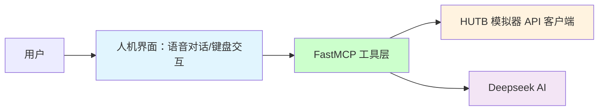

# HUTB 模拟器的 MCP 实现

基于 MCP 实现和具身人、无人车、无人机的大模型交互。

## 🏗️ 项目架构

## 1. 部署运行

**运行推荐的软硬件**

* Intel i7 gen 9th - 11th+ / AMD ryzen 9+
* +16 GB 内存
* NVIDIA RTX 3070+
* Windows 10/11

双击 [mcp.bat](./mcp.bat) 启动模拟器（第一次启动会下载相关依赖，需要等待一段时间）。

## 2. 实现

### 2.1 大模型

[基于FastMCP框架的 HUTB 智能助手](llm/README.md) 。

### 2.2 交互增强
（待实现）加上语音识别和合成的整个工作流依次包括：[麦克风](https://item.m.jd.com/product/100025694525.html) /Web浏览器、 [语音](https://mp.weixin.qq.com/s?src=11&timestamp=1754125763&ver=6150&signature=6MJAq932niAOOc0qQSU0kuIulTwbkRstev6RvAM0Q*v*bGEZEINUcdtIN4zu23ZW71o0-GD1OB7DU7YjJcCqaWt6Iv63U4SKUIy1z1cK3khakAGz-BcQuDzPMdsJEK9P&new=1) 识别（方言、老人言： PaddleSpeech ）、QWen/DeepSeek 大模型、流式语音合成 PP-TTS （语音播报/控制模拟器的模型或实体机器人）。

### 2.3 其他：[人形机器人模拟环境搭建](./model/humanoid.md)

## 3. 参考

* [基于FastMCP框架的 Github 助手](https://github.com/wink-wink-wink555/ai-github-assistant)

* [carla-mcp](https://github.com/shikharvashistha/carla-mcp)

* [网易云音乐 MCP 控制器](https://modelscope.cn/mcp/servers/lixiande/CloudMusic_Auto_Player)

* [机器人本体的仿真环境使用教程](https://kuavo.lejurobot.com/manual/basic_usage/kuavo-ros-control/docs/4%E5%BC%80%E5%8F%91%E6%8E%A5%E5%8F%A3/%E4%BB%BF%E7%9C%9F%E7%8E%AF%E5%A2%83%E4%BD%BF%E7%94%A8/) 
* [机器人本体三维模型](https://gitee.com/OpenHUTB/kuavo-ros-opensource/tree/master/src/kuavo_assets/models)
* [基于虚幻引擎的PR2机器人集成和调试](sim/README.md)（根据 [OpenSim](https://github.com/OpenHUTB/move) 建模）

* [训练MuJoCo和真实人形机器人行走](https://github.com/rohanpsingh/LearningHumanoidWalking) 
